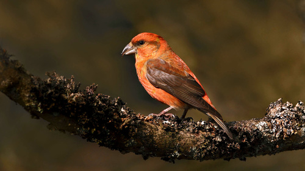
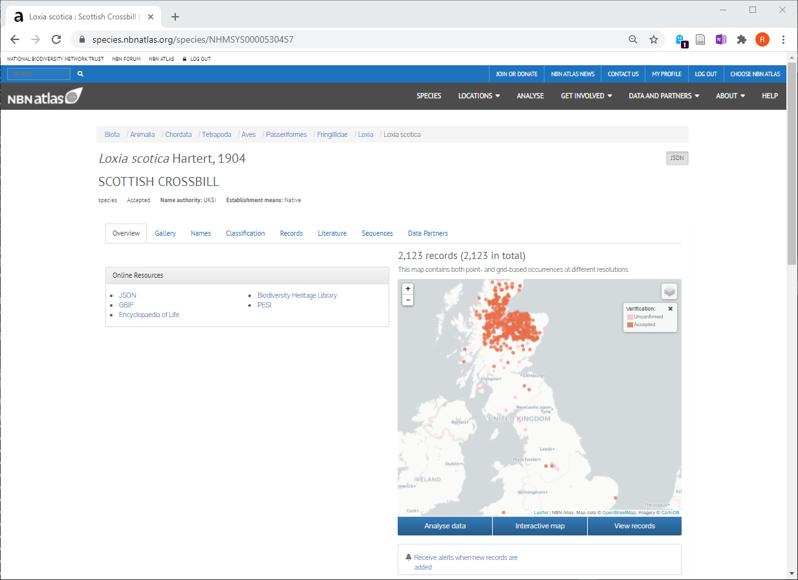
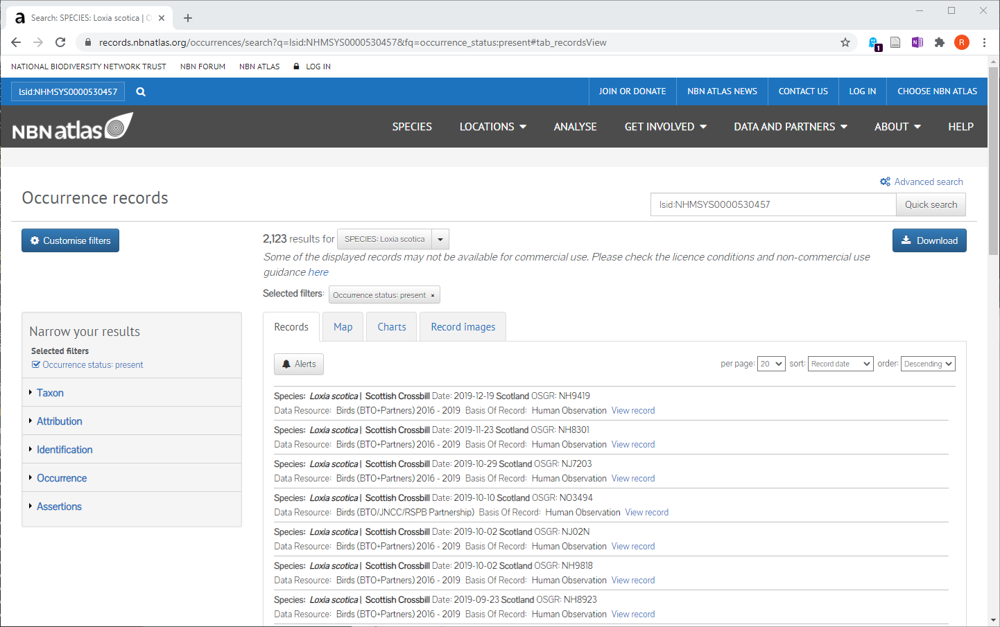

```{r setup, include=FALSE}
knitr::opts_chunk$set(echo = TRUE)
library(rgbif)
library(rinat)
library(NBN4R)
library(ggplot2)
library(dplyr)
library(lubridate)
```

# Introduction
Citizen science data is collected by volunteers, often members of the general public, that want to be engaged in aiding scientific research. Whilst the term "citizen science" is a relatively recent one, engagement with the public in the collection of scientific data has actually been going on for decades. Good examples in the UK include:

* British Trust for Ornithology (BTO) Breeding Bird Survey (BBS). This was launched in 1994 and involves counts of of breeding birds in randomly located 1 km grid squares within the Ordnance Survey National Grid. It uses a standardised methodology to count the birds, beween April and June each year, with volunteers sending their results to the BTO. <https://www.bto.org/our-science/projects/bbs>
* UK Butterfly Monitoring Conservation Scheme (UKBMS) This originated from the Butterfly Conservation Society surveys since 1976 and uses both fixed-transect walks, as well as wider surveys (based on the same squares as the BBS), in collaboration with the Centre for Ecology and Hydrology (CEH) <https://www.ceh.ac.uk/our-science/projects/uk-butterfly-monitoring-scheme> and <https://www.ukbms.org/>
* Botanical Society of the British Isles (BSBI) has created the Atlas of the British Flora (which also covers Ireland) since 1962, and has records from over 100 years ago. It's main atlas is published as a book, but it also has electronic records with regular annual surveys from volunteers <https://bsbi.org/atlas-2020>
* Taxon-specific Recording Schemes. There are large numbers of recording schemes for particular taxa, that often require specialist knowledge to identify. These include Hemiptera Recording Scheme <http://www.britishbugs.org.uk/>, Soldierfly Recording Scheme <https://www.brc.ac.uk/soldierflies-and-allies/> etc.
* Mammal species in camera traps. The public is being asked to identify species detected in camera traps, including both still and video images. This is coordinated through the MammalWeb, initially set up by Durham University with the Durham Wildlife Trust <https://www.mammalweb.org/en/>
* Invasive non-native species (INNS) recording. It is often essential to detect these species at an early stage, either to control them, or better understand their rate of spread. Good examples include the horse chestnut leaf miner <http://www.conkertreescience.org.uk/> and cellar slug survey <https://rhs.org.uk/slugsurvey> both of which are linked to Newcastle University

# Advantages and disadvantages of ecological citizen science data
Citizen science data provides an opportunity to collect large amounts of data, over wide geographical areas, using repeated sampling over many years. This gives the potential for good, long-term spatio-temporal ecological datasets for subsequent visualisation and analysis. In addition to engaging positively with the general public, it provides far more "eyes on the ground" to detect what is happening. The main problems are that for some taxa good training of volunteers may be required to ensure that data of sufficient quality are returned. Unless schemes used transect or stratified randomised surves, such as the BBS or UKBMS, there is a common problem that the datasets are **presence-only**. In other words, they record the presence of a species, but not its absence. Conventional statistical analyses, such as logistic regression (GLM with binomial errors) cannot be used with presence-only data, as there are no zeros, so alternative methods are needed. Another problem is biases in where (and when) records are collected. For example, more records are typically reported near suburban fringe areas, where the public can easily access the countryside, or nature reserves, where they may have made a special visit, than in the wider landscape, biasing the datasets. See the Canvas website for additional resources published by CEH on planning and implementing environmental citizen science projects.

# How are the data stored and accessed?
In the past all citizen science data were recorded on paper, but they can now be submitted electronically, opening up opportunities for photographic, video and audio records too. Entry can be via desktop-based websites, but increasingly mobile phone apps are also being developed to ease upload of records. The iRecord app is a good example of the latter <https://irecord.org.uk/app/> After records have been uploaded, some schemes undertake minimal data quality checks (e.g. are there geographic coordinates with a record?), others more thorough (e.g. are the geographic records of a terrestrial species given in the sea?), whilst others undertake a more thorough 'verificaction' (e.g. a taxonomic expert will look at a submitted photograph to confirm that the species identification made by the member of the public is correct). You should be aware of these differences in data quality when downloading and accessing data.

Many of the citizen science and recording schemes outlined above have their own websites where you can download previous data. You usually have to register before you can download records. Good websites include

* iRecord. This is run by the Biological Records Centre and provides access to numerous different recording schemes <https://www.brc.ac.uk/irecord/>
* iNaturalist. This is very similar to iRecord, but is international <https://www.inaturalist.org/> and like iRecord also has a phone app.
* National Biodiversity Network (NBN) <https://nbn.org.uk/> This coordinates a large number of UK-based schemes, with sub-sections for Scotland, Wales and Northern Ireland. It also provides the NBN Atlas for viewing records and downloads <https://nbnatlas.org/> which has been extensively re-structured in the last 18 months to conform to international standards, originally defined by Atlas of Living Australia (ALA)
* Global Biodiversity Information Facility (GBIF) This is the main international website, and many nationally-based schemes feed into it. For example some records (about 50%) from NBN have been transferred to GBIF, whilst iNaturalist records are also transferred. Hopefully in future this will provide a single, international repository for the bulk of citizen science data. It also uses the ALA format. <https://www.gbif.org/>

## Aims of this practical
The main aims are to familiarise you with downloading ecological data from some of the main citizen science repositories, learn how to clean and visualise the data, and conduct some simple analyses. We will look at the GBIF and iNaturalist repositories, which have CRAN packages to allow direct download of data into R. We will also explore the NBN Atlas repository, doing manual downloads from their website, to import and visualise in R. There is a development package to directly import data from NBN Atlas into R, but this can be unreliable (inst)

# Using GBIF to access data
Please create a new RStudio Project in which to store all your scripts and results.

Whilst you can manually download data from the GBIF website, it is very convenient to be able to automate the whole data processing 'pipeline' within R to make it more reproducible. First, you need to install the `rgbif` package, available as a standard R package from the CRAN repository:

```{r, eval=FALSE}
install.packages("rgbif")
library(rgbif)
```


```{r}
#key <- name_suggest(q = "Caprimulgidae", rank="family")$data["key"] # Nightjar
key <- name_suggest(q = "Loxia", rank="genus")$data["key"][1,1] # Crossbill
cntry_code <- isocodes[grep("United Kingdom", isocodes$name), "code"]
sx <- occ_search(taxonKey = key, country = cntry_code)

# To only return only if geographic coords available
sx <- occ_search(taxonKey = key, country = cntry_code, hasCoordinate = TRUE,
                 eventDate = '1990,2020', limit=2500)
unique(sx$data$scientificName)
```

You can see some duplicate scientific names, some appear to lack 'authorities' (Author and year), and one lacks the actual species. We will remove these:

```{r}
sx$data <- sx$data[sx$data$scientificName != "Loxia curvirostra curvirostra",]
sx$data <- sx$data[sx$data$scientificName != "Loxia leucoptera bifasciata (C.L.Brehm, 1827)",]
sx$data <- sx$data[sx$data$scientificName != "Loxia Linnaeus, 1758",]
unique(sx$data$scientificName)
```

Often data can be uploaded with inaccurate or incomplete information; you can see a full list of these via the `gbif_issues()` function which provides the codes, short and long descriptions of typical problems. The current list is always provided at <https://gbif.github.io/gbif-api/apidocs/org/gbif/api/vocabulary/OccurrenceIssue.html>. Some of these are more severe than others:

```{r, eval=FALSE}
problems <- gbif_issues()
View(problems)
```
```{r, echo=FALSE}
problems <- gbif_issues()
head(problems)
```

Let's clean up the data we have just downloaded, by removing any records where the "basis of the record is invalid" (`bri`), the geographic coordinate is invalid (`cdiv`) or geographic coordinate is out of range (`cdout`), or the taxon match can only be done to a higher rank and not the scientific name (`txmathi`):

```{r}
sx <- sx %>% occ_issues(-bri, -cdiv, -cdout, -txmathi) # Pipe syntax
# sx <- occ_issues(sx, -bri, -cdiv, -cdout, -txmathi) # Standard syntax
```

Check the searched data and sometimes there will be a slight decline in the number of records. There are still issues with other records; look at `sx$data$issues`, but if you cross-check their codes you can see that they are relatively minor.

## Exploring and visualising the GBIF data
Let's begin by plotting the changes in records over time, summarised for each year. This will be easiest to do so if you have `tidyverse` packages available, especially `ggplot2` and `dplyr`:

```{r, eval=FALSE}
library(ggplot2)
library(dplyr)
```

```{r}
ggplot(sx$data, aes(x=year)) +
  geom_histogram()

records_per_yr <- sx$data %>% 
  group_by(year) %>% 
  summarise(count_per_year = n())

ggplot(records_per_yr, aes(x = year, y=count_per_year)) +
  geom_line()

```

Try and adapt your queries and plots to show e.g. a bar plot for each year, or mean +/- sd or se. How would you adapt your plot for different species?

## Mapping the data


```{r, messages=FALSE}
library(leaflet)
library(leafem)
# Create map 
# We will use different colour codes for each species
unique_spp <- unique(sx$data$scientificName) # Unique list of species
marker_col <- rainbow(length(unique_spp))    # Define set of rainbow colours
base_col <- rep("red", nrow(sx$data))        # Create a vector with default red

# Next bit less complicated than it looks. We go through each row of your data
# and compare the sx$data$scientificName with the unique_spp name. If they
# match we allocate the relevant rainbow colour in marker_col to the base_col
# vector
for(i in 1:nrow(sx$data)){
  for(j in 1:length(unique_spp)){
    if(sx$data$scientificName[i] == unique_spp[j]){
      base_col[i] <- marker_col[j]
    }
  }
}

m <- addProviderTiles(leaflet(),"Esri.WorldImagery") %>% 
  ## add markers
  addCircleMarkers(sx$data$decimalLongitude, sx$data$decimalLatitude,  
                   radius = 2, fillOpacity = 0.5, opacity = 0.5, col=base_col) %>% 
  addLegend(colors = marker_col, opacity=1, labels=unique_spp)
m
```

You can see that the common crossbill _Loxia curvirostra_ is most widespread, whilst the Scottish crossbill _Loxia scotica_ is confined to Scotland (as you would expect!). The other species are rare vagrants. Try modifying your map to display an information popup when you click on a marker.

# Citizen science data from iNaturalist
You can import citizen science records directly into R from the iNaturalist website using the `rinat` package; install this using `install.packages("rinat")` and then remember to issue `library(rinat)` before accessing its functions. It operates in a fairly similar manner to the `rgbif` package, although some of the column names etc. of returned objects are slightly different. Let's begin by downloading the crossbill data as before, so that you can directly compare the two approaches.

```{r}
sx <- get_inat_obs(query = "crossbill")

```

The results are returned as a simple `data.frame` so you can look at columns directly, with only one `$` symbol e.g. `sx$scientific_name`, rather than the two-level `sx$data$scientificName` needed for the `list` results from `rgbif`. By default only 100 results are returned unless we use the `maxresults` option. Remember that this is a **global** dataset, so if we want to restrict it to the UK you need to tell the search engine. Whilst iNaturalist asks users to input the "place" name of a record, each site gets its own `place_id` code. The UK code is **6857** but this assumes that the recorder has setup the hierarchy correctly. Otherwise, you can create a "bounding box" that covers Great Britain and search within that. You can see the differences below:

```{r}
sx <- get_inat_obs(query = "crossbill", place_id=6857, maxresults=2500)
nrow(sx)

gb_ll <- readRDS("gb_simple.RDS")
plot(gb_ll)

sx2 <- get_inat_obs(query = "crossbill", bounds=gb_ll, maxresults=2500)
nrow(sx2)
```

Here the results of the two types of query are very similar, but you should be aware of the differences (use `nrow` to compare the number of entries). For now, we'll continue working with the first query, `sx` but you may wish to compare with the second. Data quality can be checked via the `quality_grade` column which distinguished between three types **research**, **casual** and **needs_id**. To ensure we have a good set of data, we will clean the data so that only the research-grade data are used:

```{r}
sx <- sx[sx$quality_grade == "research",]
nrow(sx)
unique(sx$scientific_name)
```

As before there are a few errors in the scientific names, with one only at genus level, and a goldfinch (_Carduelis carduelis_) and greenfinch (_Chloris chloris_) also returned. This is one of the risks of using common names, and in general it is better to search on Latin binomial names to get the exact species.

```{r}
sx <- sx[sx$scientific_name != "Loxia", ]
sx <- sx[sx$scientific_name != "Carduelis carduelis", ]
sx <- sx[sx$scientific_name != "Chloris chloris", ]
unique(sx$scientific_name)
```

You might be surprised at how few records there are from iNaturalist compared to GBIF. This is because iNaturalist is a more recent system, and it is only in the last few years that it has started to become very popular. You can therefore use it to look at current spatial patterns, but it would **not** be wise to use the data to assess long-term changes over time. For the latter GBIF or NBN data would be more useful.

As before, we can plot by date of the record; there is not actually a column that contains the year, and instead the `datetime` column contains the date (year-month-day) and time (24 hour time, UTC). In the UK, during winter Greenwich Mean Time (GMT) is the same as UTC, whilst during British Summer Time (BST) daylight saving changes it to UTC+1. The `datetime` column has been read as a character, so it is easier to manipulate as true dates and times via the `lubridate` library; do `install.packages("lubridate")` and `library(lubridate)` before using it:

```{r}
summary(sx$datetime) # Note character representation
# Convert datetime from character into a proper date format
sx$datetime <- sx$datetime %>%
  ymd_hms()
summary(sx$datetime) # Now correctly coded as a date and time

# Use the year() function to create a column with calendar year
sx <- sx %>% 
  mutate(year = year(datetime))
```


Now you can use a similar approach as before to look at patterns over time (although note the warnings about the iNaturalist dataset being more recent):

```{r}
ggplot(sx, aes(x=year)) +
  geom_histogram()

records_per_yr <- sx %>% 
  group_by(year) %>% 
  summarise(count_per_year = n())

ggplot(records_per_yr, aes(x = year, y=count_per_year)) +
  geom_line()

```

Similarly we can create a map of the iNaturalist citizen science data.  Note now only `sx` and not `sx$data` needed, `scientific_name` rather than `scientificName` and `latitude` rather than `decimalLatitude` etc.

```{r}
for(i in 1:nrow(sx)){  
  for(j in 1:length(unique_spp)){
    if(sx$scientific_name[i] == unique_spp[j]){
      base_col[i] <- marker_col[j]
    }
  }
}

m <- addProviderTiles(leaflet(),"Esri.WorldImagery") %>% 
  ## add markers
  addCircleMarkers(sx$longitude, sx$latitude,  
                   radius = 2, fillOpacity = 0.5, opacity = 0.5, col=base_col) %>% 
  addLegend(colors = marker_col, opacity=1, labels=unique_spp)
m
```

## Additional information from iNaturalist
### Photographs
Have a good look at the information returned from iNaturalist in the `sx` object (and similarly for your GBIF results earlier). As iNaturalist records are commonly collected by mobile phone, you will often have imagery data available. For example, for me the first record contains the following entry for `image_url`. Note that it may differ for you if iNaturalist has updated since I wrote this practical:

```{r}
sx$image_url[1]
```

Copy the link from one or more records into your browser to view the photographs. This has the potential to be extremely powerful, as you can bulk-download photographs for species from iNaturalist. These can then be used to train, for example, deep-learning models for species identification, and we will look at some of these techniques later.



### Audio
Have another look at your iNaturalist search results, in the `sound_url` column. These are much rarer, but I have one entry:

```{r}
sx$sound_url[sx$sound_url != ""] # Look for where it does not equal (!=) a blank
```

Copy and paste this into your browser and you should be able to hear about 10 seconds of chirping. Again, this type of resource has the potential to be very valuable for deep-learning models which require lots of data that someone else has already 'labelled'. We will look at some methods of basic analysis and visualisation (yes it is possible!) of audio data later.

# Citizen science data from National Biodiversity Network
## Manual download from NBN Atlas website
Manual download is somewhat slower to process, and less "reproducible". Go to the NBN Atlas website at <https://nbnatlas.org/>. Before you can download data you need valid registration username and email address for the NBN Atlas website: click the 'Login' button at the top right, and register to use the system. You will receive an email and ask you to confirm your registration. Next login with your registered username, and in the Search box at the centre of the main screen, search for **Scottish crossbill** or **Loxia scotica**. After a short delay a screen will be displayed with the species name. If you search initially just for **Loxia** then all the species in that genus will be listed. To download the records for an individual species, click on the species name and after about 30 seconds you should see:



Under the map at the bottom-right there is a button called "View Records". Click on this to display:



Click on the "Download" button, and choose Zip archive, with "Full Darwin Core" (all the information). Go for CSV as the format (default), select "Education" as the reason for the download, and accept the terms and conditions. The download request will be processed, and when it is read you will receive an email with a link to the original search, and a link to your zip file. Download and unzip the latter; I have unzipped it into a subfolder within my RStudio project called `nbn_records`. **Note**: the name of your CSV file may differ depending on what you named your zip file in the NBN website. You can then import the data into R using the usual `read.csv` function

```{r}
nbn <- read.csv("nbn_records/nbn_records.csv")
nbn <- nbn[nbn$identificationVerificationStatus.processed == "Accepted",]
```

Again, we can look at changes over time in total number of records:

```{r}
ggplot(nbn, aes(x=year.processed)) +
  geom_histogram()

records_per_yr <- nbn %>% 
  group_by(year.processed) %>% 
  summarise(count_per_year = n())

ggplot(records_per_yr, aes(x = year.processed, y=count_per_year)) +
  geom_line()

```

Finally, let's create a map of the records, using a similar technique as before, but renaming columns etc. as appropriate, and simplifying the plot as we only have one species:

```{r}
m <- addProviderTiles(leaflet(),"Esri.WorldImagery") %>% 
  ## add markers
  addCircleMarkers(nbn$decimalLongitude.processed, nbn$decimalLatitude.processed,  
                   radius = 2, fillOpacity = 0.5, opacity = 0.5, col="red") %>% 
  addLegend(colors = "red", opacity=1, labels="Scottish Crossbill")
m
```

If you go onto the **Advanced Search" part of the NBN Atlas website, you will see that it is possible to delineate more precisely what you want, search for multiple species, etc.

## Automatic download using `NBN4R` (functionality unreliable)
Ideally you would automate the process to download from the NBN Atlas. Whilst a development package `NBN4R` has been created, its functionality is unreliable in that sometimes it operates without any errors, and other days the same R script fails because it cannot access various intermediate webservers. You should therefore treat this section as optional. Do not worry if it does not work.
### Install the NBN4R package
As `NBN4R` is a "development" package it is not on the main CRAN repository yet, so the installation is a little more complex than usual. Try either:

```{r, eval=FALSE}
install.packages("devtools")
library(devtools)
install_github("fozy81/NBN4R")
```

or if this gives you errors, an alternative installation is:

```{r, eval=FALSE}
install.packages("remotes")
library(remotes)
install_github("fozy81/NBN4R")
```

If you receive an error about a missing package not being available, try installing the missing package manually e.g. `install.packages("stringr")` and then attempt to re-install `NBN4R`.


## Configure the NBN4R package
The NBN asks that you provide a "reason" why you want to download the data which you can display via the `nbn_reasons()` function. I have picked the "scientific research" (option 4) but I leave it to you as to which you think is most suitable:

```{r}
library(NBN4R)
nbn_reasons()
nbn_config(download_reason_id = 4)
```

Next, it is very easy to make a typing error, or make a request for a species which has not been recorded in an areas. It is useful to display a warning if no species are returned:

```{r}
nbn_config(warn_on_empty=TRUE)
```

# Searching and visualising taxonomies: crossbills, true finches
Crossbills (_Loxia_ species) belong to the family Fringillidae, sometimes called "true finches". These are small birds in Britain including many other species from other genera. We can search across this family from the NBN Atlas database, and then display the phylogenetic tree, requesting the genus name, scientific name, and rank, as well as the unique ID code. Use the `View(tx[])` command to look at the results:


```{r}
tx <- taxinfo_download("rk_family:Fringillidae",
                       fields=c("guid","rk_genus","scientificName","rank"))
# View(tx[])  # List structure in R so need empty square brackets to access the data
```

You can see there are 37 rows in the returned table of taxonomic information, with an indication of whether you are looking at species or genus data. You can if you wish, plot a taxonomic tree using the `plotTree` from the `phytools` package. Use `install.packages("phytools")` to install it first:

```{r}
library(phytools)
tx <- tx[tx$rank %in% c("species","subspecies"),] ## restrict to species and subspecies

## as.phylo requires the taxonomic columns to be factors
tx$genus <- as.factor(tx$genus)
tx$scientificName <- as.factor(tx$scientificName)

## create phylo object of scientific Latin name nested within Genus
ax <- as.phylo(~genus/scientificName, data=tx)
plotTree(ax, type="fan", fsize=0.6)
```

If you want, it is possible to change the structure of the displayed taxonomic tree, and even add photos of species to the dendrogram. See the NBN4R website.

# Displaying occurence data of crossbills
To actually download the crossbill data, use the `occurrences` function. It is best to have the caching switched off, because if the download fails for any reason there is a risk of a repeat download of the previous (failed) attempt. It is also useful to have a full trace of any error messages:


```{r}
nbn_config(caching="off")
nbn_config(verbose=TRUE)
```

To download the data, try:

```{r, eval=FALSE}
loxia_recs <- occurrences(taxon="Loxia scotica", download_reason_id=10,
                          email="your.email@newcastle.ac.uk", verbose=TRUE)
```

If `loxia_recx` contains `0L` the download has failed completely. If it contains just a single number, then for some reason a count of the number of records, rather than the actual records, has been returned. The `occurrences` function in `NBN4R` actually calls the equivalent function from the Atlas for Living Australia `ALA4R` package. Sometimes this is more reliable. You can use this by prefixing the function with `ALA4R::`

```{r, eval=FALSE}
loxia_recs <- ALA4R::occurrences(taxon="Loxia", download_reason_id=10,
                                email="your.email@newcastle.ac.uk", verbose=TRUE)
```

If for some reason neither of these approaches works, I have put an RDS (R data file) onto Canvas which you should download into your project folder as an alternative so you can better understand the format of the data:

```{r}
loxia_recs <- readRDS("nbn_Loxia.RDS")
```

Assuming the download is successful, you will want to remove unconfirmed records. The `loxia_recs` is a "list" structure, with the actual records stored in a `data` slot, so you need to use `View(loxia_recs$data)` to view the data.frame etc. The quality of the record is in `identificationVerificationStatus`.  There are far more data available when searching this way. For simplicity, you may wish reduce to reduce it to just to just one species, Scottish crossbills, _Loxia scotica_, for display, but you can visualise the whole dataset if you want.

```{r}
# Remove unconfirmed records
unique(loxia_recs$data$identificationVerificationStatus)
nrow(loxia_recs$data)
loxia_recs$data <- loxia_recs$data[loxia_recs$data$identificationVerificationStatus != "Unconfirmed",]
loxia_recs$data <- loxia_recs$data[loxia_recs$data$identificationVerificationStatus != "Unconfirmed - not reviewed",]
nrow(loxia_recs$data)

# Check list of species
unique(loxia_recs$data$scientificName)
# Remove records only identified to genus Loxia
loxia_recs$data <- loxia_recs$data[loxia_recs$data$scientificName != "Loxia",]
# Loxia curvirostra curvirostra is the subspecies for Loxia curvirostra
# (common crossbill). Generally recorded the same so may be better to merge
# Use a conditional search with == inside square brackets to replace
# subspecies with species
loxia_recs$data$scientificName[loxia_recs$data$scientificName == "Loxia curvirostra curvirostra"] <- "Loxia curvirostra"
unique(loxia_recs$data$scientificName)

# If you only keep Loxia scotica for simplicity for now
loxia_scotica <- loxia_recs
loxia_scotica$data <- loxia_scotica$data[loxia_scotica$data$scientificName == "Loxia scotica",]
nrow(loxia_scotica$data)
```

Now, as before, display a plot of changes over time:

```{r}
ggplot(loxia_scotica$data, aes(x=startDateYear)) +
  geom_histogram()

records_per_yr <- loxia_scotica$data %>% 
  group_by(startDateYear) %>% 
  summarise(count_per_year = n())

ggplot(records_per_yr, aes(x = startDateYear, y=count_per_year)) +
  geom_line()

```

and finish with a `leaflet` interactive plot:

```{r}
m <- addProviderTiles(leaflet(),"Esri.WorldImagery") %>% 
  ## add markers
  addCircleMarkers(loxia_scotica$data$longitudeWGS84, loxia_scotica$data$latitudeWGS84,  
                   radius = 2, fillOpacity = 0.5, opacity = 0.5, col="red") %>% 
  addLegend(colors = "red", opacity=1, labels="Scottish Crossbill")
m
```

Try modifying the above code, and display all 4 species of crossbill, using different colour codes, using the `loxia_recs` data. See the example from the iNaturalist map earlier. Also try modifying your line plot to display different lines for each species over time.

# Take home messages
You have seen that there are a wide range of different sources of citizen science data, that is "relatively" easy to download either from within R (the ideal for automatic, reproducible data-processing pipelines), via the citizen science website. We have explored just a small selection today. Key points to note include:

* large amounts of data often available, depending on taxa
* data quality issues: have identifications been verified etc?
* inconsistent variable names, even from the same citizen science website if the data is accessed via different methods. For example you have seen: `latitude`, `latitudeWGS84`, `decimalLatitude` and `decimalLatitude.processed` all referring to the same thing.
* inconsistent R data objects. Sometimes a simple data.frame is returned, so you can use things such as `myrecords$latitude` to access a column. Sometimes a structured list is returned, which may require `myrecords$data$latitude` to access a column
* inconsistent terms used to measure the "quality" of the records, as to whether they have been verified. e.g. "Research grade" vs "Confirmed" may have different meanings.

# In your own time
Try downloading some taxa records for species you are particularly interested in. Plot the number of records over time, and produce some interactive `leaflet` maps to visualise the citizen science data. Compare the same taxon between two or more different citizen science websites.
